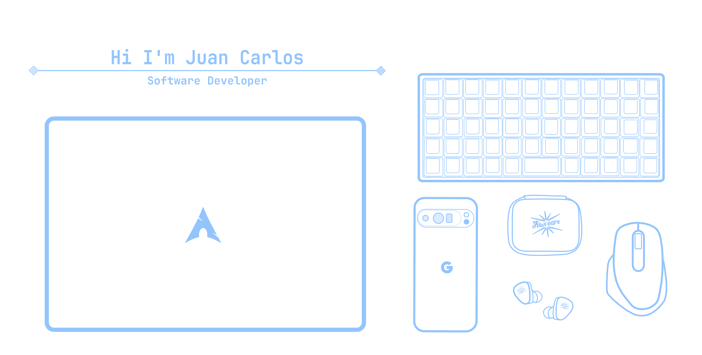

  

   

  
  
  

  <h1>About Me</h1>

### 👋 Hello World! I'm Juancho

Hello everyone, my name is 𝓙𝓾𝓪𝓷 𝓒𝓪𝓻𝓵𝓸𝓼, affectionately called 𝓙𝓾𝓪𝓷𝓬𝓱𝓸. I was born and raised in a small countryside town dedicated to **☕ specialty coffee production** in Colombia. My parents are from the countryside and dedicate themselves to producing **specialty coffee** - I grew up in the countryside and it's something I'm deeply **proud of**. I love coffee, and it's curious how almost all developers seem to share this same passion! 

I started programming and fell in love with this industry a few years ago. Like everyone starting in the world of software development, there are countless paths to choose from. Initially, I wanted to dedicate myself to **🔐 cybersecurity**, but gradually I found my calling in **🌐 web development** and, more broadly, developing applications and services that can be deployed on **☁️ cloud infrastructure**. 

Beyond coding, I love to **📚 read** and **🎵 listen to music**. I believe in being **💯 honest** and **🤝 helping others**. I have several projects and ambitious goals that I'm determined to achieve. I hope you enjoy my work - I always strive to be **📐 organized and methodical** in everything I do, from life to code.

### 🐧 Linux Enthusiast & Lifelong Learner

I'm a **Linux enthusiast** - it was my first approach to software development, so I have a lot of affection for it (I generally use **Arch Linux with GNOME** 🖥️).

If there's something I didn't mention, it's that I **love learning**. I'm a learning enthusiast, and I'm not just talking about learning new technologies or programming languages, but learning everything that life can offer me 🌟.

Related to my learning is that I also **love teaching**. I was educated in one of the best public schools in Santander, Colombia, which is also pedagogical. This made me like teaching and doing it correctly and clearly 👨‍🏫.

I like to **solve problems**, understand them, and try to find a solution. Everything has a why and what for, and personally, it's something I like to do, although sometimes not so much 🧩.

I try to be **organized and pragmatic** with my life, and this covers almost everything, even the way I write code. I try to apply almost everything that can help me as a developer 💻.

---

### 🎯 What Drives Me

<table align="center">
<tr>
<td align="center" width="25%">
<h3>🐧 Linux Enthusiast</h3>

Optimizing development environments and exploring Linux distros

</td>
<td align="center" width="25%">
<h3>🎓 Lifelong Learner</h3>

Learning something new every day and applying it to real projects

</td>
<td align="center" width="25%">
<h3>🤝 Knowledge Sharer</h3>

Helping others with convergent learning and clear teaching

</td>
<td align="center" width="25%">
<h3>🧩 Problem Solver</h3>

Tackling complex challenges and finding elegant solutions

</td>
</tr>
</table>

### 💎 Code Craftsman
*Writing clean, maintainable, and elegant code that brings ideas to life*

 

---

## 💼 Portfolio & Projects

### 🏥 Full-Stack Applications

**Vet-Care** - *Complete Veterinary Management System*
> Full-stack application for veterinary appointment management with separate dashboards for users and veterinarians. Features real-time scheduling, patient records, and secure authentication system.

**Tech Stack:** React, Tailwind CSS, Node.js, Express.js, MySQL, Sequelize, JWT

 

### 🌐 Web Development

**Personal Portfolio** - *Modern Developer Portfolio*
> Responsive web portfolio showcasing my work and skills. Built with modern technologies and minimalist design principles, featuring smooth animations and optimized performance.

**Tech Stack:** React, TypeScript, Tailwind CSS, Responsive Design

 

**Notion Landing Page** - *UI/UX Clone Project*
> Pixel-perfect recreation of Notion's landing page as my first approach to software development. Focused on responsive design and modern web standards.

**Tech Stack:** HTML5, CSS3, JavaScript, Responsive Design

 

### 🔐 Backend & APIs

> **Authentication API** - *Secure REST API with JWT*
> 
> 
> 
> 
> **Tech Stack:** PostgreSQL, JavaScript, JWT, Sequelize, REST API

---

## 🏆 Certifications & Achievements

### 🎓 Programming & Development

> **Git y GitHub** - *Platzi*
> 
> 
> 
> 
> Comprehensive course on version control with Git and collaboration through GitHub, including branching strategies, merge conflicts resolution, and best practices for team development.

> **Full Stack Web Development Bootcamp** - *Ministry of ICT (MinTIC)*
> 
> 
> 
> 
> Intensive bootcamp covering HTML, CSS, JavaScript, DOM manipulation, and Python. Gained hands-on experience building dynamic web applications and understanding both frontend and backend development fundamentals.

### ☁️ DevOps & Cloud

> **DevOps on AWS and Project Management** - *Amazon Web Service*
> 
> 
> 
> 
> Comprehensive training in DevOps practices on AWS cloud platform and project management methodologies. Covered CI/CD pipelines, infrastructure as code, monitoring, and agile project management techniques.

### 🔒 Cibersegurity

> **Cibersecurity Fundamentals** - *IBM*
> 
> 
> 
> 
> While cybersecurity is not my main area of specialization, I believe it’s essential for any developer—especially those building cloud-based services and applications—to understand its fundamentals. Through this course, I gained key knowledge about cyber threats, attack types, social engineering, cryptography, and the defense strategies organizations use to prevent and respond to security incidents.

  <h1>Tech Stack</h1>

  
  
  
  
  
  
  
  
  
  
  
  
  
  
  
  
  
  
  

  <h1>Current Goals</h1>

## 🎯 Professional Goals

- 🔥 **Learning**: Advanced React patterns and performance optimization
- 🌱 **Exploring**: New terminal productivity tools and development workflows
- 🤝 **Building**: Side projects to showcase creative coding techniques
- 📚 **Studying**: System design and architecture patterns for scalable apps
- 🎨 **Creating**: Beautiful and functional user interfaces

## 🌟 Life Goals

- 👥 **Community Building**: Create a study and software development community
- 📚 **Writing**: Write a book unrelated to programming, focused on literature
- 🌍 **Language Learning**: Learn to speak English fluently to connect with more people and get better job opportunities
- 🎓 **Education**: Start a Software Engineering degree (Bachelor's Degree)

## ⛏️ Tech Stack Goals 

- 🚀 **Learn Astro**: Astro is considered one of the most prominent JavaScript frameworks, and I intend to study it in the near future to enhance my development skills.
- ☕ **Learn Java**: Actually, Java was the first programming language in which I wrote my first "Hello World" (not easy) and I wanted to reconcile with it and learn it.
- 🚄 **Learn Fast API**: It's one of the best frameworks for building solid backends (also built by a Colombian), so I'd like to learn it and apply it to projects.

  <h1>Contact With Me</h1>

  
  
  
  

---

  Thanks for visiting! 🚀 Let's build something amazing together!

