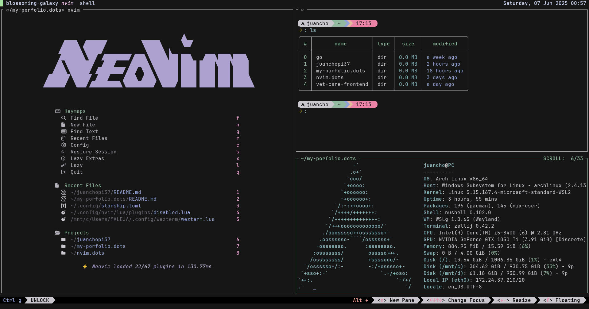
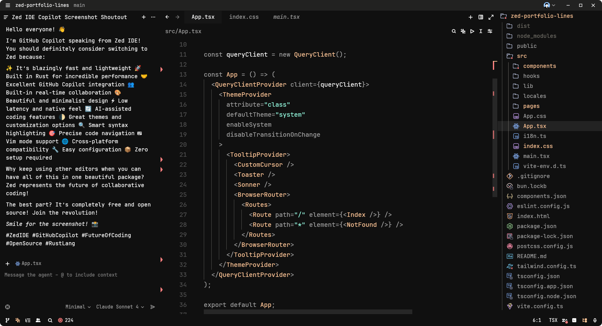

  

   

  
  
  

 

  <h1>About Me</h1>

 **Linux Enthusiast** - I enjoy tinkering with Linux distros and optimizing my development environment

 **Lifelong Learner** - I strive to learn something new every day and apply that knowledge in real-world projects

 **Knowledge Sharer** - I have a convergent learning style and take pleasure in helping others with what I know

 **Problem Solver** - I love tackling complex challenges and finding elegant solutions

 **Code Craftsman** - Writing clean, maintainable, and elegant code that brings ideas to life

 

  <h1>My Code Space</h1>

  <h2>Neovim + LazyVim</h2>

  

- Nushell as my shell
- Zellij as my multiplexer
- Neovim as my editor
- LazyVim as my Neovim configuration (plugins and more)
- Wezterm as my terminal
- Starship as my prompt terminal

You can [try](https://github.com/juancholops/nvim.dots) this setup.

Thanks to Gentleman Programming, this entire setup is a fork of his main project.
You can visit him [here](https://github.com/Gentleman-Programming/Gentleman.Dots); he's constantly adding cool stuff.

  <h2>Zed IDE</h2>

  

It's an IDE that I've been testing in the last few days; it's definitely an alternative to VSCode, fast, lightweight, and with a growing community (oh, and written in rust 😎).

- Font: JetBrainsMono Nerd Font
- Icon Theme: Catppucin Mocha
- Theme: Vesper

You can try Zed. Download it [here](https://zed.dev/download).

  <h1>Tech Stack</h1>

  
  
  
  
  
  
  
  
  
  
  
  
  
  
  
  
  
  
  

  <h1>Current Goals</h1>

- 🔥 **Learning**: Advanced React patterns and performance optimization
- 🌱 **Exploring**: New terminal productivity tools and development workflows
- 🤝 **Building**: Side projects to showcase creative coding techniques
- 📚 **Studying**: System design and architecture patterns for scalable apps
- 🎨 **Creating**: Beautiful and functional user interfaces

  <h1>Contact With Me</h1>

  
  
  
  

---

  Thanks for visiting! 🚀 Let's build something amazing together!

