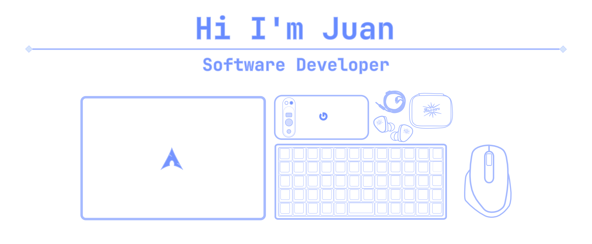

  

   

   

  

    
    
    
    
    <a href="https://obsidian.md/">
        <svg role="img" viewBox="0 0 24 24" xmlns="http://www.w3.org/2000/svg"><title>Zen Browser</title><path d="M24 12c0 6.627-5.373 12-12 12S0 18.627 0 12 5.373 0 12 0s12 5.373 12 12zm-12 9.846c5.438 0 9.846-4.408 9.846-9.846S17.438 2.154 12 2.154 2.154 6.562 2.154 12 6.562 21.846 12 21.846zM20 12a8 8 0 1 1-16 0 8 8 0 0 1 16 0zm-8 6.462a6.462 6.462 0 1 0 0-12.924 6.462 6.462 0 0 0 0 12.924zm0-1.847a4.615 4.615 0 1 0 0-9.23 4.615 4.615 0 0 0 0 9.23zM15.692 12a3.692 3.692 0 1 1-7.384 0 3.692 3.692 0 0 1 7.384 0z"/></svg>
    </a>
  

  

 

## 👨‍💻 About Me

🐧 **Linux Enthusiast** - I enjoy tinkering with Linux distros and optimizing my development environment

🚀 **Lifelong Learner** - I strive to learn something new every day and apply that knowledge in real-world projects

🧠 **Knowledge Sharer** - I have a convergent learning style and take pleasure in helping others with what I know

💡 **Problem Solver** - I love tackling complex challenges and finding elegant solutions

💻 **Code Craftsman** - Writing clean, maintainable, and elegant code that brings ideas to life

 

  <h1>My Code Space</h1>

  <h2>Neovim + LazyVim</h2>

  

- Nushell as my shell
- Zellij as my multiplexer
- Neovim as my editor
- LazyVim as my Neovim configuration (plugins and more)
- Wezterm as my terminal
- Starship as my prompt terminal

### Did you like this neovim setup?

You can try this setup.

https://github.com/juanchopi37/nvim.dots

Thanks to Gentleman Programming, this entire setup is a fork of his main project.
You can visit him [here](https://github.com/Gentleman-Programming/Gentleman.Dots); he's constantly adding cool stuff.

  <h2>Zed IDE</h2>

  

It's an IDE that I've been testing in the last few days; it's definitely an alternative to VSCode, fast, lightweight, and with a growing community (oh, and written in rust 😎).

- Font: JetBrainsMono Nerd Font
- Icon Theme: Catppucin Mocha
- Theme: Vesper

You can try Zed. Download it [here](https://zed.dev/download).

## 📊 GitHub Statistics

  

## 🛠️ Tech Stack

### 💻 Programming Languages

  
  
  
  
  

### 🌐 Frontend Technologies

  
  
  
  
  

### ⚙️ Backend & Runtime

  
  
  

### 🗄️ Database & Design

  
  
  

### 🔧 Tools & Workflow

  
  
  

---

## 🎯 Current Goals

- 🔥 **Learning**: Advanced React patterns and performance optimization
- 🌱 **Exploring**: New terminal productivity tools and development workflows
- 🤝 **Building**: Side projects to showcase creative coding techniques
- 📚 **Studying**: System design and architecture patterns for scalable apps
- 🎨 **Creating**: Beautiful and functional user interfaces

---

## 🌐 Connect With Me

  
  
  
  

---

  

   

**Thanks for visiting! 🚀 Let's build something amazing together!**

   

