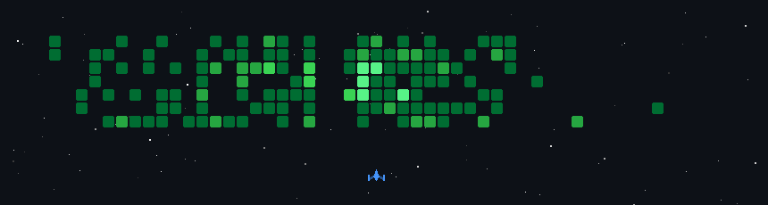

    

# Trayectoria

Mi nombre es Juan Carlos, como ya muy seguramente lo sabrás si has llegado hasta aquí, soy un desarrollador de software en fase beta (por así decirlo). Me gusta el mundo de la programación y el desarrollo de software.

Hace algunos años, tras fracasar en una carrera que estaba estudiando, decidí apostarle al desarrollo de software. Fue Linux ese primer paso que me hizo pararme en frente de una terminal y conocer poco a poco el mundo del open source y, por ende, del desarrollo de software.

Al principio es algo difícil, tantas ramas y caminos por los que te puedes ir en el mundo de la tecnología: ¿Ciberseguridad? ¿Desarrollo móvil? ¿DevOps? Casi que es una lista infinita de cosas que realmente me emocionaban. Aunque al principio me decanté un poco por la ciberseguridad, pronto descubrí que no quería ser ni un pentester ni me veía haciendo un SQL injection a una base de datos.

Pero algo sí sabía y era que me gustaba un montón que las cosas estuvieran pulidas estéticamente, que tuvieran una buena presentación y que fueran fáciles de entender y usar. Así que empecé a decantarme por el desarrollo web en la parte del frontend. Como es lógico, también me empezó a interesar la parte del backend y, por ende, también tenía que aprender todo sobre una base de datos. Y así, de poco a poco, veía que tenía que aprender más y más, pero todos sabemos que de eso se trata desarrollar software: de aprender cosas nuevas y aplicarlas.

# Diferenciarse

El mundo del desarrollo de software en cualquier rama es supremamente competitivo, hay que saber muy bien en que invertir tiempo y sobre todo aprender muy bien los fundamentos si no quieres dar dos pasos atrás, también hay que saber en que especializarse y enfocarse en ello, tratar de no abarcar tanto sino especializarce en algo concreto, en mi caso mi caso cada día quiero especializarme en desarrollo web, pero también me llama la atención el desarrollo mobile, cloud y devops, quizás mas adelante pueda incursionar en él mas profundamente.

La inteligencia artificial es sin duda alguna una muy buena herramienta puedes construir buenos prototipos fácilmente, puedes solucionar un problema de tipado específico (muy común en TypeScript y a veces un dolor de cabeza) o puedes solucionar bugs simples de importación, sin embargo creo que para desarrollar código escalable y mantenible a largo plazo es dificil de hacerlo, es mas como una herramienta pero de doble filo, si la usas en exceso en un par de prompts ya tienes un menjurge de código que no sabes ni lo que hace, por eso siempre me enfoco en aprender a leer código de la IA y a poder debugearlo y decidir cuando si va y cuando no debo aceptar sus cambios. Siempre trato de aprender sin usar la IA porque realmente no estarías aprendiendo, realmente tienes que pasar por el proceso de que no te corra el código porque dejaste un error de sintaxis. 

También comprendo lo fundamental que son las Soft Skills, ya que de nada sirve que sepas mucho sobre el código sino sabes comunicarte correctamente con los demás miembros de un equipo, y no solo es comunicarse asertivamente que suena muy bien en el CV, sino realmente tener un ínteres genuino sobre los demás y sobre los proyectos que se quieran llevar a cabo, ya que todos somos personas y empezar a comprender que todos debemos merecer respeto y dar respeto es el primer paso para ser un buen miembro en un equipo y tener buena convivencia. 
